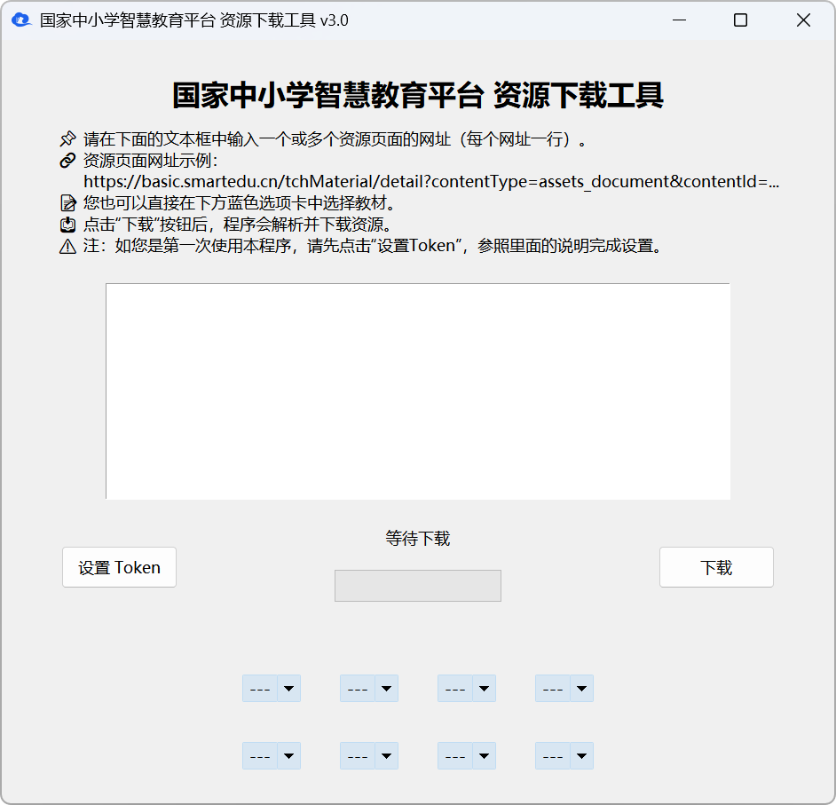

# [国家中小学智慧教育平台 电子课本](https://basic.smartedu.cn/tchMaterial/)下载工具


本工具可以帮助您从[**国家中小学智慧教育平台**](https://basic.smartedu.cn/)获取电子课本的 PDF 文件网址并进行下载，让您更方便地获取课本内容。

## ✨ 工具特点

- 📚**支持批量下载**：一次输入多个电子课本预览页面网址，即可批量下载 PDF 课本文件。
- 📂**自动命名文件**：工具会自动使用电子课本的名称作为默认文件名，方便管理下载的课本文件。
- 🔖**自动添加书签**：若勾选了 “添加书签” 选项，则会在下载完成后为电子课本添加书签，在查看 PDF 时可更方便地跳转到指定位置。
- 🔑**支持 Access Token**：支持用户[手动输入 Access Token](#2--设置-access-token可选) 并自动保存，下次启动可自动加载。
- 🖥️**高 DPI 适配**：优化 UI 以适配高分辨率屏幕，避免界面模糊问题。
- 💻**跨平台支持**：支持 Windows、Linux、macOS 等操作系统（需要图形界面）。



## 📥 下载与安装方法

### GitHub Releases

本项目的 [GitHub Releases 页面](https://github.com/happycola233/tchMaterial-parser/releases)会发布**适用于 Windows、Linux 的 x86_64 架构**与**适用于 Linux、macOS 的 Arm64 架构**的程序。

下载完成之后不需要额外的安装步骤。Windows 和 Linux 可直接运行本程序。

> [!WARNING]
> 在 macOS 操作系统中，由于没有签名，系统会报告文件已被损坏，因此需要先运行 `xattr -cr /path/to/tchMaterial-parser.app` 来移除应用的 “隔离” 属性。为了保证 Access Token 的持久化，建议将应用移动到 `/Applications` 目录下再运行。

### Arch 用户软件仓库（AUR）

对于 **Arch Linux** 操作系统，本程序已发布至[Arch 用户软件仓库](https://aur.archlinux.org/packages/tchmaterial-parser)，因此您还可以通过在终端中输入以下命令安装：

```sh
yay -S tchmaterial-parser
```

感谢 [@iamzhz](https://github.com/iamzhz) 为本工具制作了发行包（[#26](../../issues/26)）！

## 🛠️ 使用方法

### 1. ⌨️ 输入电子课本链接

将电子课本的**预览页面网址**粘贴到工具文本框中，支持多个 URL（每行一个）。

**示例网址**：

```text
https://basic.smartedu.cn/tchMaterial/detail?contentType=assets_document&contentId=XXXXXX&catalogType=tchMaterial&subCatalog=tchMaterial
```

### 2. 🔑 设置 Access Token（可选）

> [!TIP]
> 自 v3.1 版本起，这一步操作已经**不再必要**，当未设置 Access Token 时工具会使用其他方法下载资源。然而，这一方法**并不长期有效**，因此仍然建议您进行这一步操作。

1. **打开浏览器**，访问[国家中小学智慧教育平台](https://auth.smartedu.cn/uias/login)并**登录账号**。
2. 按下 **F12** 或 **Ctrl+Shift+I**，或右键——检查（审查元素）打开**开发者工具**，选择**控制台（Console）**。
3. 在控制台粘贴以下代码后回车（Enter）：

   ```js
   (function () {
     const authKey = Object.keys(localStorage).find((key) =>
       key.startsWith("ND_UC_AUTH"),
     );
     if (!authKey) {
       console.error("未找到 Access Token，请确保已登录！");
       return;
     }
     const tokenData = JSON.parse(localStorage.getItem(authKey));
     const accessToken = JSON.parse(tokenData.value).access_token;
     console.log(
       "%cAccess Token:",
       "color: green; font-weight: bold",
       accessToken,
     );
   })();
   ```

4. 复制控制台输出的 **Access Token**，然后在本工具中点击 “**设置 Token**” 按钮，粘贴并保存 Token。

> [!NOTE]
> Access Token 可能会过期，若下载失败，请重新获取并设置新的 Token。

### 3. 🚀 开始下载

点击 “**下载**” 按钮，工具将自动解析并下载 PDF 课本。

本工具支持**批量下载**，所有 PDF 文件会自动按课本名称命名并保存在选定目录中。

若您勾选了 “**设置书签**” 复选框，则本工具会在课本下载完成后自动为其添加书签，在查看 PDF 时可快速跳转到指定位置。


## ❓ 常见问题

### 1. ⚠️ 为什么下载失败？

- 如果您没有设置 Access Token，可能是本工具使用的方法失效了，请[**设置 Access Token**](#2--设置-access-token可选)🔑。
- 如果您设置了 Access Token，由于其具有时效性（一般为 7 天），因此极有可能是 **Access Token 过期了**，请重新获取新的 Access Token。
- **确认网络连接是否正常**🌐，有时网络不稳定可能导致下载失败。
- **确保输入的网址有效**🔗，部分旧资源可能已被移除。

### 2. 💾Access Token 保存在哪里？

- **Windows**：Token 会存储在**注册表** `HKEY_CURRENT_USER\Software\tchMaterial-parser` 项中的 `AccessToken` 值。
- **Linux**: Token 会存储在**文件** `~/.config/tchMaterial-parser/data.json` 中。
- **macOS**：Token 会存储在**文件** `~/Library/Application Support/tchMaterial-parser/data.json` 中。
- **其他操作系统**：Token 仅在运行时临时存储于内存，不会自动保存，程序重启后需重新输入，目前我们正在努力改进该功能。

### 3. 🔐Token 会不会泄露？

- 本工具**不会上传** Token，也不会存储在云端，仅用于本地请求授权。
- **请勿在公开场合分享 Token**，以免您的账号被他人使用，造成严重后果。

## ⭐Star History

[](https://star-history.com/#happycola233/tchMaterial-parser&Date)

## 🤝 贡献指南

如果您发现 Bug 或有改进建议，欢迎提交 **Issue** 或 **Pull Request**，让我们一起完善本工具！

## 📜 许可证

本项目基于 [MIT 许可证](LICENSE)，欢迎自由使用和二次开发。

## 💌 友情链接

- 📚 您也可以在 [ChinaTextbook](https://github.com/TapXWorld/ChinaTextbook) 项目中下载归档的电子课本 PDF。
