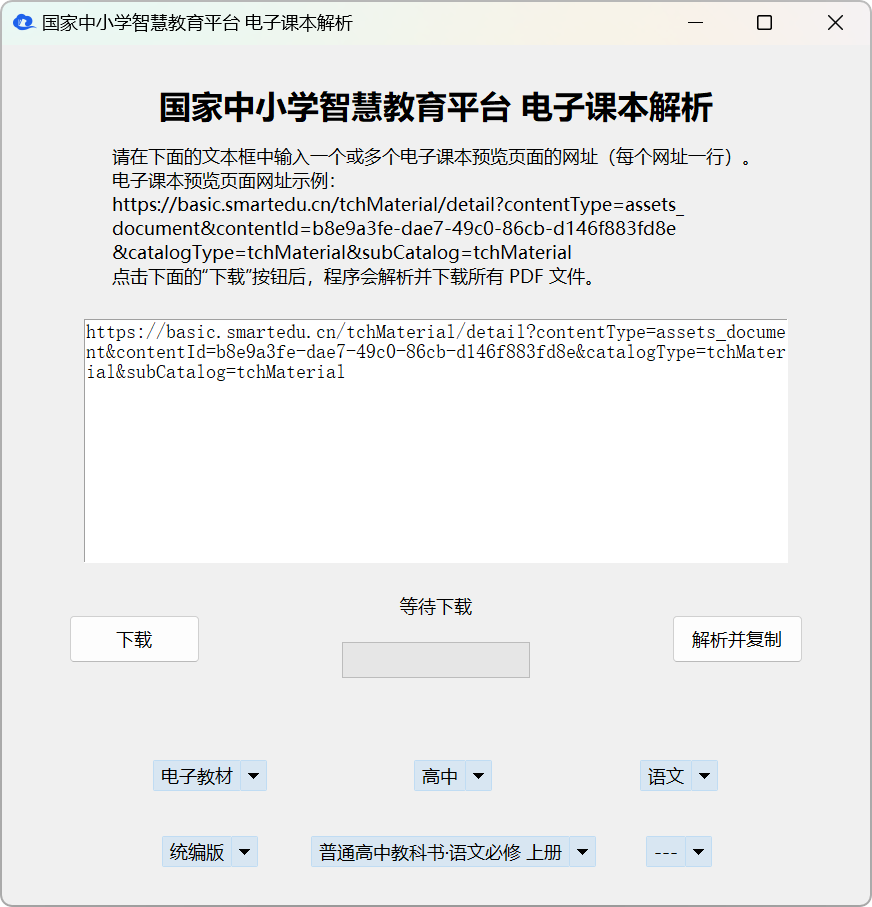

# [国家中小学智慧教育平台](https://basic.smartedu.cn/tchMaterial/) 电子课本下载工具

本工具可以帮助您从**国家中小学智慧教育平台**中获取电子课本的 PDF 文件网址并进行下载，让您更方便地获取课本内容。

电子课本预览页面的网址格式如 <https://basic.smartedu.cn/tchMaterial/detail?contentType=assets_document&contentId=b8e9a3fe-dae7-49c0-86cb-d146f883fd8e&catalogType=tchMaterial&subCatalog=tchMaterial>。

本工具支持 **Windows**、**Linux**、**macOS** 等操作系统（需要图形化界面）。

## ✨ 工具特点

- **支持批量下载** 📚：如果您输入多个电子课本预览页面的网址，本工具可批量下载电子课本。无论是单个文件还是多个文件，工具都能根据您的需求自动解析和下载。
  
- **下载管理合理** 📂：对于单个电子课本，您可以选择下载到指定文件夹并自动使用教材名称作为文件名。对于多个电子课本，您可以选择自定义保存路径，程序会将所有PDF文件下载到该文件夹下。
  
- **快速复制链接** 🔗：除了下载功能，您还可以选择只解析并复制电子课本的PDF下载链接，方便您后续分享或使用其他下载工具（如 IDM）下载。

- **高DPI适配** 🖥️：本工具已对高DPI屏幕进行了适配，确保在高分辨率屏幕下显示正常，不会出现字体或UI模糊的问题。

- **多线程下载** 🚀：使用多线程技术进行下载，避免因为文件过大或网络延迟导致的程序无响应，提升用户体验。

- **详细的下载进度显示** 📊：在下载过程中，工具会实时显示下载进度，通过进度条和状态标签，您可以直观地查看下载进度和下载任务的完成情况。

## 🛠️ 使用方法

1. **输入URL**：将电子课本的预览页面网址粘贴到程序窗口的文本框中。如果您有多个电子课本需要下载，请换行分割每个网址。

2. **选择操作**：
   - **解析并复制** 📋：点击“**解析并复制**”按钮，工具会解析每个网址对应的PDF下载链接，并将解析后的链接复制到剪贴板。
   - **下载** 📥：点击“**下载**”按钮，工具会提示您选择保存路径，并开始下载PDF文件。对于单个文件，您可以选择保存位置和文件名；对于多个文件，程序会自动使用教材名称作为文件名并保存到指定文件夹。

3. **查看进度** 📈：在下载过程中，您可以查看窗口底部的进度条和状态标签，了解当前的下载进度和任务完成情况。

## 📸 截图

## ❓ 常见问题

### 1. 如何处理下载失败的问题？⚠️

- **检查网络连接** 🌐：请确保您的设备已连接到互联网，并且网络畅通。
- **检查链接有效性** 🔗：请确认您输入的电子课本链接是有效的，并且可以通过浏览器访问。
- **重试下载** 🔄：在某些情况下，网络波动可能导致下载失败，建议您重新尝试下载。

### 2. 高DPI显示问题 🖥️

- 如果您在高分辨率屏幕下发现界面显示不正常，您可以尝试调整代码中的缩放因子，或在Windows的显示设置中更改缩放级别。

## ⭐ Star History

## 🤝 贡献指南

如果您对本项目有任何建议或发现了Bug，欢迎提交Issue或Pull Request。我们非常感谢大家对本项目的支持！

## 📜 许可证

本项目使用 [MIT License](LICENSE) 许可证。
