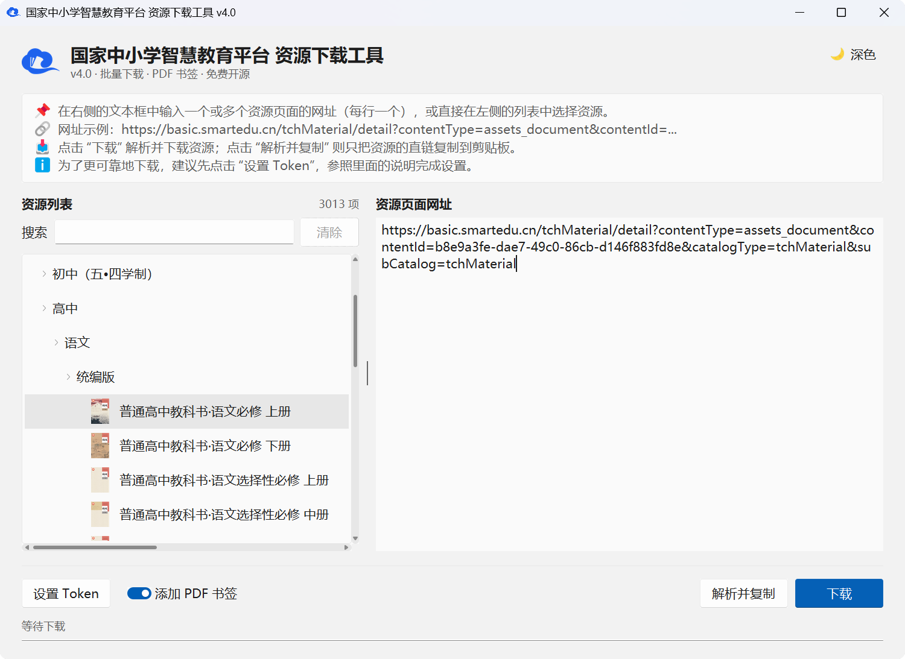
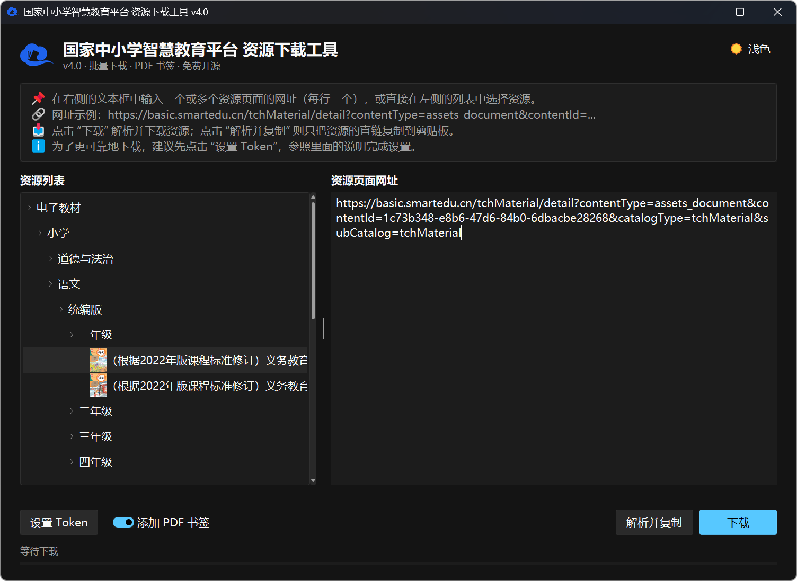
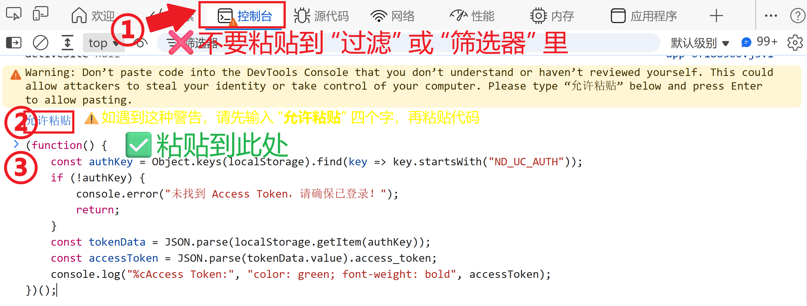
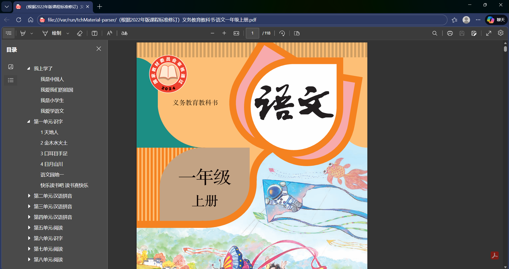

<div align="center">


# tchMaterial-parser

**[国家中小学智慧教育平台](https://basic.smartedu.cn/) [电子课本](https://basic.smartedu.cn/tchMaterial/)下载工具**

一键解析并批量下载电子课本文件，自动命名、自动添加书签，开箱即用。

<br />

[](../../releases/latest)
[](../../releases)
[](../../stargazers)
[](https://www.python.org/)
[](../../releases)
[](LICENSE)

[](https://trendshift.io/repositories/13774)

感谢每一位使用者与贡献者，本项目于 2025 年 5 月登上 **GitHub Trending 总榜第 3 名**（单日新增约 400 Stars），并获得 [**Trendshift Python 日榜第 3 名**](https://trendshift.io/repositories/13774) 🎉

[📥 下载安装](#-下载与安装方法) · [🛠️ 使用方法](#️-使用方法) · [❓ 常见问题](#-常见问题) · [🐛 反馈问题](../../issues)

</div>

---

<div align="center">




<sub>☀️ 浅色模式（左） &nbsp;·&nbsp; 🌙 深色模式（右）</sub>

</div>

## 📖 目录

- [✨ 工具特点](#-工具特点)
- [📥 下载与安装方法](#-下载与安装方法)
- [🛠️ 使用方法](#️-使用方法)
- [❓ 常见问题](#-常见问题)
- [⭐ Star History](#-star-history)
- [🤝 贡献指南](#-贡献指南)
- [⚖️ 免责声明](#️-免责声明)
- [📜 许可证](#-许可证)

## ✨ 工具特点

- 📚 **支持批量下载**：一次输入多个电子课本预览页面网址，即可批量下载电子课本文件。
- 📂 **自动命名文件**：工具会自动使用电子课本的名称作为默认文件名，方便管理下载的课本文件。
- 🔖 **自动添加书签**：若开启 “添加 PDF 书签”，则会在下载完成后为电子课本添加书签，在查看 PDF 时可更方便地跳转到指定位置。
- 🔑 **支持 Access Token**：支持用户[手动输入 Access Token](#2--设置-access-token可选) 并自动保存，下次启动可自动加载。
- 🔎 **教材快速搜索**：可按教材名称或 “学段、学科、年级” 等分类组合搜索，结果会自动展开；长名称支持横向滚动，悬停时可查看完整信息和大尺寸封面。
- 🖥️ **高 DPI 适配**：优化 UI 以适配高分辨率屏幕，避免界面模糊问题。
- 🌗 **深色模式**：启动时自动跟随系统的浅色/深色模式，也可点击右上角的按钮手动切换，切换结果会被记住。
- 💻 **跨平台支持**：支持 Windows、Linux、macOS 等操作系统（需要图形界面）。

## 📥 下载与安装方法

| 方式 | 适用平台 | 获取途径 |
| :-- | :-- | :-- |
| [🐙 **GitHub Releases**](#github-releases) | Windows / Linux / macOS（x86_64、Arm64） | [前往 Releases 页面](../../releases) |
| [📦 **WinGet**](#winget) | Windows 10 / 11 / Server 2025 | `winget install tchMaterial-parser` |
| [🐧 **AUR**](#arch-用户软件仓库aur) | Arch Linux | `yay -S tchmaterial-parser` |
| [🐍 **从源码运行**](#从源码运行) | 任意平台（需 Python 3.10+） | [见下文](#从源码运行) |

### GitHub Releases

本项目的 [GitHub Releases 页面](../../releases)会发布适用于 **Windows、Linux、macOS** 的 **x86_64、Arm64** 架构的程序。

下载完成之后不需要额外的安装步骤。Windows 和 Linux 可直接运行本程序。

> [!WARNING]
> 在 macOS 操作系统中，由于没有签名，系统会报告文件已被损坏，因此需要先运行 `xattr -cr /path/to/tchMaterial-parser.app` 来移除应用的 “隔离” 属性。为了保证 Access Token 的持久化，建议将应用移动到 `/Applications` 目录下再运行。

### WinGet

在 **Windows 10、Windows 11 与 Windows Server 2025** 上，您可以直接在终端中输入以下命令来安装本程序：

```batch
winget install tchMaterial-parser
```

感谢 [@PtJade-Ceramic](https://github.com/PtJade-Ceramic) 的建议（[#64](../../issues/64)）！

### Arch 用户软件仓库（AUR）

对于 **Arch Linux** 操作系统，本程序已发布至 [Arch 用户软件仓库](https://aur.archlinux.org/packages/tchmaterial-parser)，因此您可以在终端中输入以下命令来安装本程序：

```sh
yay -S tchmaterial-parser
```

感谢 [@iamzhz](https://github.com/iamzhz) 为本工具制作了发行包（[#26](../../issues/26)）！

### 从源码运行

若您想体验最新的改动，或是希望参与开发，可以直接从源码运行本工具，需要 **Python 3.10 或更高版本**（`X | Y` 形式的类型注解仅在该版本及以后的版本可用）。

```sh
git clone https://github.com/happycola233/tchMaterial-parser.git
cd tchMaterial-parser
pip install .
python ./src/main.py
```

> [!NOTE]
> 本工具使用 Tkinter 构建图形界面。Windows 与 macOS 的官方 Python 通常已自带，而部分 Linux 发行版需要单独安装，例如在 Debian/Ubuntu 上执行 `sudo apt install python3-tk`。
>
> 此外，精简安装的 Linux 系统可能缺少中文字体与 Emoji 字体，此时界面上可能会出现方框等异常现象。可按需安装，例如在 Debian/Ubuntu 上执行 `sudo apt install fonts-noto-cjk fonts-noto-color-emoji`。

若您想自行打包为可执行文件，可以在安装 `pyinstaller` 后执行：

```sh
pyinstaller ./tchMaterial-parser.spec
```

编译后的程序位于 `dist` 目录中。

## 🛠️ 使用方法

### 1. ⌨️ 输入电子课本链接

将电子课本的**预览页面网址**粘贴到工具文本框中，支持多个 URL（每行一个）。

**示例网址**：

```text
https://basic.smartedu.cn/tchMaterial/detail?contentType=assets_document&contentId=XXXXXX&catalogType=tchMaterial&subCatalog=tchMaterial
```

### 2. 🔑 设置 Access Token（可选）

> [!TIP]
> 自 v3.1 版本起，这一步操作已经**不再必要**，当未设置 Access Token 时工具会使用其他方法下载资源。然而，这一方法**并不长期有效**，因此仍然建议您进行这一步操作。

> [!WARNING]
> 友情提示：
>
> 1. **先登录账号，再粘贴代码！**
> 2. 粘贴代码时，不要粘贴到 “过滤” 或 “筛选器” 上，而是 “>” 后面！
> 3. 粘贴时如遇到警告，请先输入 “**允许粘贴**” 四个字，然后再次粘贴代码！
>
> 

1. **打开浏览器**，访问[国家中小学智慧教育平台](https://auth.smartedu.cn/uias/login)并**登录账号**。
2. 按下 **F12** 或 **Ctrl+Shift+I**，或右键——检查（审查元素）打开**开发者工具**，选择**控制台（Console）**。
3. 在控制台粘贴以下代码后回车（Enter）：

   ```js
   (function () {
     const authKey = Object.keys(localStorage).find((key) =>
       key.startsWith("ND_UC_AUTH"),
     );
     if (!authKey) {
       console.error("未找到 Access Token，请确保已登录！");
       return;
     }
     const tokenData = JSON.parse(localStorage.getItem(authKey));
     const accessToken = JSON.parse(tokenData.value).access_token;
     console.log(
       "%cAccess Token:",
       "color: green; font-weight: bold",
       accessToken,
     );
   })();
   ```

4. 复制控制台输出的 **Access Token**，然后在本工具中点击 “**设置 Token**” 按钮，粘贴并保存 Token。

> [!NOTE]
> Access Token 可能会过期，若下载失败，请重新获取并设置新的 Token。

### 3. 🚀 开始下载

点击 “**下载**” 按钮，工具将自动解析并下载电子课本文件。

本工具支持**批量下载**，所有文件会自动按课本名称命名并保存在选定目录中。

若您开启了 “**设置 PDF 书签**”，则本工具会在课本下载完成后自动为其添加书签，在查看 PDF 时可快速跳转到指定位置。

<div align="center">



</div>

## ❓ 常见问题

<details open>
<summary><b>1. ⚠️ 为什么下载失败？</b></summary>

<br />

- 如果您没有设置 Access Token，可能是本工具使用的方法失效了，请[**设置 Access Token**](#2--设置-access-token可选)🔑。
- 如果您设置了 Access Token，由于其具有时效性（一般为 7 天），因此极有可能是 **Access Token 过期了**，请重新获取新的 Access Token。
- **确认网络连接是否正常**🌐，有时网络不稳定可能导致下载失败。
- **确保输入的网址有效**🔗，部分旧资源可能已被移除。

</details>

<details>
<summary><b>2. 💾 Access Token 保存在哪里？</b></summary>

<br />

- **Windows**：Token 会存储在**注册表** `HKEY_CURRENT_USER\Software\tchMaterial-parser` 项中的 `AccessToken` 值。
- **Linux**：Token 会存储在**文件** `~/.config/tchMaterial-parser/data.json` 中。
- **macOS**：Token 会存储在**文件** `~/Library/Application Support/tchMaterial-parser/data.json` 中。
- **其他操作系统**：目前暂不支持持久化，目前我们正在寻找通用的解决方案。

</details>

<details>
<summary><b>3. 🔐 Token 会不会泄露？</b></summary>

<br />

- 本工具**不会上传** Token，也不会存储在云端，仅用于本地请求授权。
- **请勿在公开场合分享 Token**，以免您的账号被他人使用，造成严重后果。

</details>

## ⭐ Star History

<div align="center">
<a href="https://www.star-history.com/?repos=happycola233%2FtchMaterial-parser&type=date&legend=top-left">
 <picture>
   <source media="(prefers-color-scheme: dark)" srcset="https://api.star-history.com/chart?repos=happycola233/tchMaterial-parser&type=date&theme=dark&legend=top-left&sealed_token=lp-dz0jwomojnfZdkKWtPYjxu2cIaluD151Uh_sKuhgbIy1MAw4WMMHg9KPtHrdNSur9Z6j6P4cR0NAR7-8vT_ttSDIBynMuDVy5ljc73IMV_4RAyLzs1GtoC6yH3QNnQtQahl8r9J2REXs-NNJ7Pu55SQ2X52m6JNy5v91zdGypyXAi758su9beu7pb" />
   <source media="(prefers-color-scheme: light)" srcset="https://api.star-history.com/chart?repos=happycola233/tchMaterial-parser&type=date&legend=top-left&sealed_token=lp-dz0jwomojnfZdkKWtPYjxu2cIaluD151Uh_sKuhgbIy1MAw4WMMHg9KPtHrdNSur9Z6j6P4cR0NAR7-8vT_ttSDIBynMuDVy5ljc73IMV_4RAyLzs1GtoC6yH3QNnQtQahl8r9J2REXs-NNJ7Pu55SQ2X52m6JNy5v91zdGypyXAi758su9beu7pb" />
   
 </picture>
</a>
</div>

## 🤝 贡献指南

如果您发现 Bug 或有改进建议，欢迎提交 **[Issue](../../issues)** 或 **[Pull Request](../../pulls)**，让我们一起完善本工具！

感谢所有为本项目做出贡献的朋友：

<div align="center">
<a href="https://github.com/happycola233/tchMaterial-parser/graphs/contributors">
  
</a>
</div>

## ⚖️ 免责声明

- 本工具**仅提供下载上的便利**，不存储、不托管、不分发任何教材内容，所有资源均直接来自[国家中小学智慧教育平台](https://basic.smartedu.cn/)。
- 所下载资源的**版权归原平台及相关权利人所有**，请仅用于个人学习与教学参考，**请勿用于商业用途或二次分发**。
- 使用本工具时请遵守该平台的服务条款及您所在地区的法律法规。因使用本工具产生的任何后果由使用者自行承担。
- 本项目与国家中小学智慧教育平台**没有任何隶属或合作关系**。

## 📜 许可证

本项目基于 [MIT 许可证](LICENSE)，欢迎自由使用和二次开发。

## 💌 友情链接

- 📚 您也可以在 [ChinaTextbook](https://github.com/TapXWorld/ChinaTextbook) 项目中下载归档的电子课本 PDF。

<div align="center">
<sub>如果这个工具对您有帮助，欢迎点一个 ⭐ Star 支持一下！</sub>
</div>
